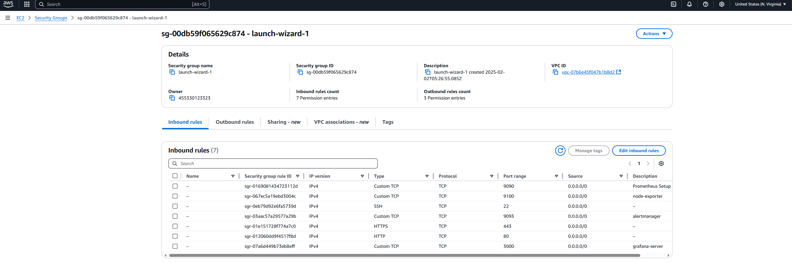
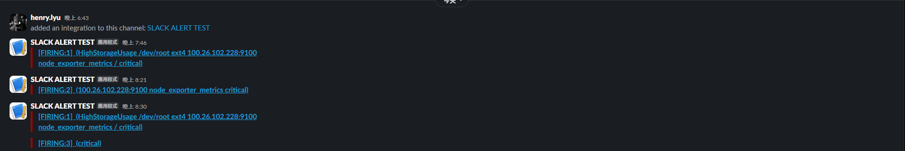

# Prometheus + Grafana Alerting Stack with AWS SES and Slack

> Monitoring system for AWS EC2 instances with Prometheus, Grafana dashboards, and alert notifications via Slack and AWS SES SMTP.

This project is for practice and documentation purposes. The EC2 and IAM configurations have been suspended.

## Architecture

```
+------------------------------------------------------------------+
|                          AWS VPC                                  |
|                                                                   |
|  +--------------+    +--------------+    +--------------+         |
|  |   EC2 #1     |    |   EC2 #2     |    |   EC2 #N     |         |
|  | node_exporter|    | node_exporter|    | node_exporter|         |
|  |   :9100      |    |   :9100      |    |   :9100      |         |
|  +------+-------+    +------+-------+    +------+-------+         |
|         |                   |                   |                  |
|         +-------------------+-------------------+                  |
|                             | scrape metrics                      |
|                    +--------v--------+                             |
|                    |   Prometheus    |                             |
|                    |     :9090       |                             |
|                    |  (rules eval)   |                             |
|                    +---+--------+----+                             |
|                        |        |                                  |
|              query     |        | fire alerts                     |
|                        |        |                                  |
|               +--------v--+  +--v-----------+                     |
|               |  Grafana  |  | Alertmanager |                     |
|               |   :3000   |  |    :9093     |                     |
|               | dashboards|  +--+--------+--+                     |
|               +-----------+     |        |                        |
|                                 |        |                        |
+---------------------------------+--------+------------------------+
                                  |        |
                          +-------v--+  +--v--------+
                          |  Slack   |  |  AWS SES  |
                          | Webhook  |  |   SMTP    |
                          +----------+  +-----------+
```

## Features

- Prometheus: Metrics collection with 15s scrape interval
- Grafana: Pre-configured dashboards (CPU, Memory, Disk, Network)
- Alertmanager: Multi-channel alerting with severity-based routing
- Alert Rules: CPU, Memory, Disk, Network, Instance health
- Slack: Real-time alert notifications with formatted messages
- AWS SES: Email alerts with HTML templates
- Docker Compose: One-command deployment

## Prerequisites

- Docker Engine 20.10+
- Docker Compose V2
- AWS SES verified domain/email (for email alerts)
- Slack Incoming Webhook URL (for Slack alerts)

## Quick Start

### 1. Clone and Configure

```bash
git clone https://github.com/kjkj1232/Prometheus-Grafana-for-Alerting-with-AWS-SES-and-Slack.git
cd Prometheus-Grafana-for-Alerting-with-AWS-SES-and-Slack
cp .env.example .env
# Edit .env with your Slack webhook URL and AWS SES credentials
```

### 2. Start the Stack

```bash
docker compose up -d
```

### 3. Access Services

| Service      | URL                    |
|-------------|------------------------|
| Prometheus  | http://localhost:9090   |
| Grafana     | http://localhost:3000   |
| Alertmanager| http://localhost:9093   |

Default Grafana login: admin / changeme (change in .env)

## Project Structure

```
.
├── docker-compose.yml              # Full stack deployment
├── .env.example                    # Environment variables template
├── prometheus/
│   ├── prometheus.yml              # Prometheus configuration
│   └── rules/
│       ├── cpu_thresholds_rules.yml
│       ├── memory_thresholds_rules.yml
│       ├── storage_thresholds_rules.yml
│       ├── instance_shutdown_rules.yml
│       └── network_thresholds_rules.yml
├── alertmanager/
│   ├── alertmanager.yml            # Alertmanager configuration
│   └── templates/
│       ├── slack.tmpl              # Slack message template
│       └── email.tmpl              # HTML email template
├── grafana/
│   ├── provisioning/
│   │   ├── datasources/
│   │   │   └── prometheus.yml      # Auto-configure Prometheus datasource
│   │   └── dashboards/
│   │       └── dashboards.yml      # Dashboard provisioning config
│   └── dashboards/
│       └── node-exporter.json      # Pre-built monitoring dashboard
└── screenshots/
    ├── EC2.png
    ├── Grafana.png
    ├── Security-Groups.png
    ├── prometheus.png
    └── Slack.png
```

## Alert Rules

### CPU Alerts
| Alert | Threshold | Duration | Severity |
|-------|-----------|----------|----------|
| HighCpuUsage | > 80% | 5m | warning |
| CriticalCpuUsage | > 95% | 2m | critical |
| HighCpuIoWait | > 20% | 5m | warning |

### Memory Alerts
| Alert | Threshold | Duration | Severity |
|-------|-----------|----------|----------|
| HighMemoryUsage | > 80% | 5m | warning |
| CriticalMemoryUsage | > 95% | 2m | critical |
| HighSwapUsage | > 50% | 5m | warning |

### Storage Alerts
| Alert | Threshold | Duration | Severity |
|-------|-----------|----------|----------|
| HighDiskUsage | > 80% | 5m | warning |
| CriticalDiskUsage | > 95% | 2m | critical |
| DiskFillPrediction | Fill in 24h | 30m | warning |
| FilesystemReadOnly | readonly | 1m | critical |

### Instance Alerts
| Alert | Condition | Duration | Severity |
|-------|-----------|----------|----------|
| InstanceDown | unreachable | 1m | critical |
| InstanceReboot | boot < 5m ago | 0m | info |
| ClockSkewDetected | offset > 50ms | 5m | warning |

### Network Alerts
| Alert | Threshold | Duration | Severity |
|-------|-----------|----------|----------|
| HighNetworkReceive | > 100MB/s | 5m | warning |
| HighNetworkTransmit | > 100MB/s | 5m | warning |
| NetworkInterfaceDown | interface down | 2m | critical |

## Alert Routing

Alerts are routed based on severity:
- `critical` → Slack + Email (repeat every 1h)
- `warning` → Slack + Email (repeat every 4h)
- `info` → Slack only (repeat every 12h)

Inhibition rules suppress warning alerts when a critical alert is already firing for the same instance.

## EC2 Node Exporter Setup

To monitor remote EC2 instances, install node_exporter on each:

```bash
# Download and install
# Check latest version at https://github.com/prometheus/node_exporter/releases
VERSION=1.8.2
wget https://github.com/prometheus/node_exporter/releases/download/v${VERSION}/node_exporter-${VERSION}.linux-amd64.tar.gz
tar xvfz node_exporter-${VERSION}.linux-amd64.tar.gz
sudo mv node_exporter-${VERSION}.linux-amd64/node_exporter /usr/local/bin/

# Create systemd service
sudo tee /etc/systemd/system/node_exporter.service > /dev/null <<EOF
[Unit]
Description=Node Exporter
After=network.target

[Service]
User=node_exporter
ExecStart=/usr/local/bin/node_exporter
Restart=always

[Install]
WantedBy=multi-user.target
EOF

sudo useradd -rs /bin/false node_exporter
sudo systemctl daemon-reload
sudo systemctl enable --now node_exporter
```

Then update `prometheus/prometheus.yml` to add the EC2 targets.

## Security Groups

Ensure the following ports are open in your AWS Security Groups:

| Port | Service | Access |
|------|---------|--------|
| 9090 | Prometheus | Internal only |
| 9093 | Alertmanager | Internal only |
| 9100 | Node Exporter | Internal only |
| 3000 | Grafana | As needed |
| 587 (outbound) | SMTP | AWS SES endpoint |

## Screenshots

### Grafana Dashboard


### AWS EC2 Instances


### Security Groups


### Prometheus Alerts


### Slack Notifications


## Tech Stack

- [Prometheus](https://prometheus.io/) - Metrics collection and alerting
- [Grafana](https://grafana.com/) - Visualization and dashboards
- [Alertmanager](https://github.com/prometheus/alertmanager) - Alert routing and notification
- [Node Exporter](https://github.com/prometheus/node_exporter) - Linux system metrics
- [AWS SES](https://aws.amazon.com/ses/) - Email delivery
- [Docker Compose](https://docs.docker.com/compose/) - Container orchestration

